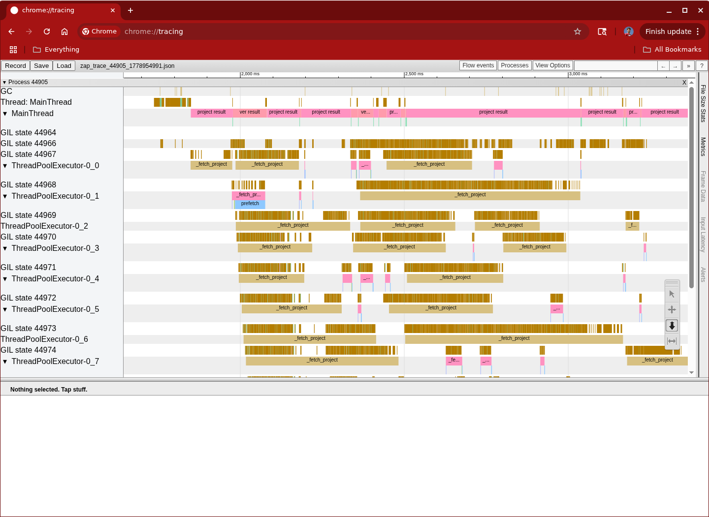
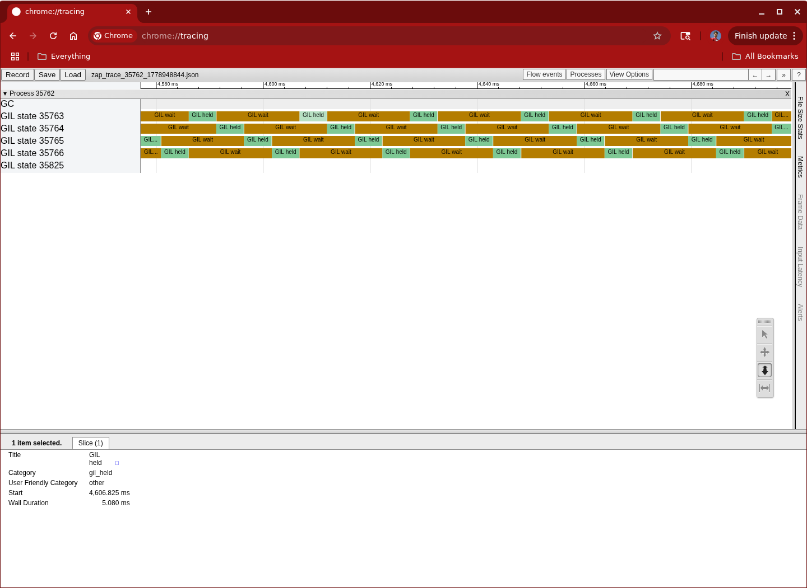
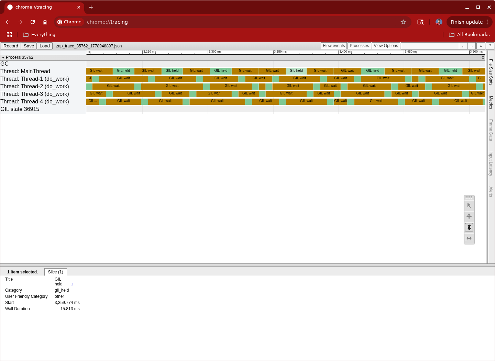

# zap-trace

This lets you monitor (among other things) GIL waits of a target process.  It's
a bit experimental, but generally does not destabilize the process you're
monitoring.  Generally.

On Linux, you'll need to run

```
sudo sysctl -w kernel.yama.ptrace_scope=0
```

or simply run as root.  On Mac, you will get an auth prompt the first time you
run.

## Real-world example: hdeps

I have a "debugging resolver" called hdeps, which reads metadata off pypi to try
to discover conflicts in your dep tree.  It spends most of its time doing
network, but also has significant sections that are GIL-bound.  This file is
checked in as `zap_trace_44905_1778954991.json` if you want to give it a look.



(note: to use `--keke --gil` together, you will need to attach rather than
spawning)

## Trying it out

If you run `python docs/threads.py` in one window, it will tell you its PID.
This starts four background threads that are a busy-loop.  Run

```
uvx --prerelease=allow zap-trace -p <that pid> --gil
```

and it will output a file that you can load in `chrome://tracing` or Perfetto.

You can click on boxes and zoom in to find more information -- you can for
example see that the switch interval is about 5ms.



If you hit Enter in the target process, now it will start calculating a sum
(which uses native code).  You can see that it (the main thread) holds the GIL
for about 15ms, and the others are running less regularly than before (but
having to share what time is left on that one core).




# Version Compat

This library seems to work on 3.10-3.14 (with GIL, Frida only compiles as abi3
today).  The target process can be on something more like 3.8-3.14 (including
nogil).


# Versioning

This library follows [meanver](https://meanver.org/) which basically means
[semver](https://semver.org/) along with a promise to rename when the major
version changes.

# License

zap-trace is copyright [Tim Hatch](https://timhatch.com/), and licensed under
the MIT license.  See the `LICENSE` file for details.
